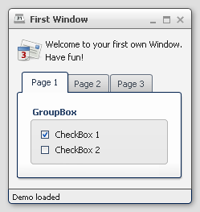
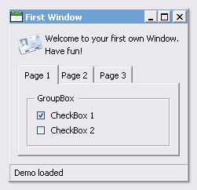
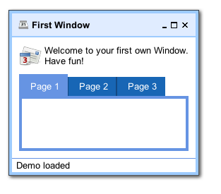
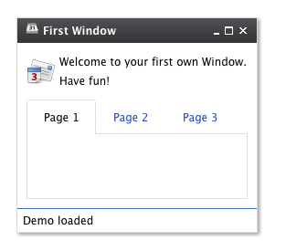

# Theming

Qooxdoo includes four themes:

- `Modern` - a graphically rich theme, showcasing many UI capabilities of
  Qooxdoo %{version}
- `Classic` - MS Windows oriented theme
- `Simple` - a lightweight theme, which looks more like a website.
- `Indigo` - a theme, based on simple but offers the style of the qooxdoo.org
  website.

Here some screenshots:









While those four themes run out-of-the-box, it is easy to create your own
themes. Those custom themes can either be created by extending existing ones
desktop/ui_custom_themes.md#extending_themes or they can be created from scratch
desktop/ui_custom_themes.md#custom_themes.

A complete theme (a so-called _meta theme_) consists of several special themes,
each designed to play a dedicated role and to setup the different parts of the
whole theming. These special themes are described at the subsequent sections
followed by a description of how to create own themes.

## Meta Theme

A meta theme describes the whole theme itself by defining the specific parts.
Each meta theme consists of five keys

- appearance
- color
- decoration
- font
- icon

each of them referencing to a specialized theme. So you can think of a meta
theme as of collection whose parts can easily be changed.

Sample of a meta theme:

```
qx.Theme.define("qx.theme.Modern",
{
  meta :
  {
    color : qx.theme.modern.Color,
    decoration : qx.theme.modern.Decoration,
    font : qx.theme.modern.Font,
    appearance : qx.theme.modern.Appearance,
    icon : qx.theme.icon.Tango
  }
}
```

This section describes the different types of themes which are used for theming
a whole application.

## Color Theme

A color theme defines all colors used by the framework. Each color is defined by
an unique name and a value which can be written as hex, rgb or named color. This
defined name is usable throughout the whole framework and your application.

> :memo: The best way to organize your color names is to use **semantic ones** like
> `background`, `text-input` or `text-disabled`. This way it is easier to use
> one color for multiple widgets.

Part of a sample color theme:

```
/**
 * sample color theme
 */
qx.Theme.define("myApplication.theme.sample.Color",
{
  colors :
  {
    /*
    ----------------------------------------------------------------------
      SAMPLE COLORS
    ----------------------------------------------------------------------
    */

    // color as hex value
    "background-application" : "#DFDFDF",

    // color as rgb array
    "background-pane" : [ 128, 128, 128 ],

    // color as named color
    "background-light" : "gray",
  }
});
```

Following names are recognized as named colors: `black`, `white`, `silver`,
`gray`, `maroon`, `red`, `purple`, `fuchsia`, `green`, `lime` , `olive`,
`yellow`, `navy`, `blue`, `teal`, `aqua`, `orange`, `brown` .

The color values are set in the class
[qx.util.ColorUtil](apps://apiviewer/#qx.util.ColorUtil)

## Decoration Theme

Each widget can be equipped with an independent decoration which can be used to
set a background-color or -image, define a border, add a shadow and much more.
In a decoration theme you can use several different decorators depending on the
results you wish to achieve. Please take a look at the decorator article
(ui_decorators) to get more information.

> :memo: It is recommended to define the decorations inside the theme instead of
> creating manually decorator instances inside your application code. This way
> the created decorators can be used by multiple widgets.

What a decoration theme can look like:

```
/**
 * Sample decoration theme.
 *
 * @asset(sample/decoration/myDecorationTheme/*)
 */
qx.Theme.define("myApplication.theme.sample.Decoration",
{
  aliases : {
    decoration : "myApplication/decoration/sample"
  },

  decorations :
  {
    "single" :
    {
      decorator: qx.ui.decoration.Single,

      style :
      {
        width : 1,

        color : "red",
        colorLeft : "black",
        colorRight : "white",

        style : "solid"
      }
    },

    "grid" :
    {
      decorator : qx.ui.decoration.Grid,

      style :
      {
        baseImage : "decoration/pane/grid.png"
      }
    },


    "combined" :
    {
      decorator : [
        qx.ui.decoration.MBackgroundColor,
        qx.ui.decoration.MBorderRadius
      ],

      style :
      {
        backgroundColor : "button",
        radius : 3
      }
    }
});
```

Noted the `@asset` at the top and the `aliases` key inside the theme
declaration? This is needed to for the images used within the theme. A
description of how to work with resources is available here
ui_resources.md#declaring_resources_in_the_code.

> :memo: The `aliases` key is especially important when defining an own decorator
> theme. This entry does add a new alias at the `AliasManager` class and
> verifies that your images for the decoration theme are found by the
> `ResourceManager` which is working with the resolve URLs of the `AliasManager`
> class.

## Font Theme

This theme is all about the information of the fonts used throughout your
application. As the number of types/variants of fonts used with application
isn't that big the font theme is normally a compact one. Web fonts are also
defined here. See the article on web fontsui_webfonts.md#webfonts for details.

> :memo: It is always a good idea to limit the number of types or variants of fonts to
> create a homogenous look.

To demonstrate how compact and powerful a font theme can look like, take a look
at the example font theme:

```
/**
 * The modern font theme.
 */
qx.Theme.define("qx.theme.modern.Font",
{
  fonts :
  {
    "default" :
    {
      size : 11,
      lineHeight : 1.4,
      family : [ "Tahoma", "Liberation Sans", "Arial" ]
    },

    "bold" :
    {
      size : 12,
      lineHeight : 1.4,
      family : [ "Lucida Grande" ],
      bold : true
    }
  }
});
```

It is important to note that you can only specify values available as property
on [qx.bom.Font](apps://apiviewer/#qx.bom.Font) or  
[qx.bom.webfonts.WebFont](apps://apiviewer/#qx.bom.webfonts.WebFont).

## Icon Theme

This theme is to define which icon set is used and normally consists only of 2
main keys (title and aliases).

The important one is the `aliases` key which points the generator to the
location of the icon set. The `icon` alias, which is used to reference icons in
Qooxdoo applications, is set to the value of this key. As Qooxdoo uses the free
available [Tango](http://tango.freedesktop.org/Tango_Desktop_Project) and
[Oxygen](http://www.oxygen-icons.org) icon sets it is not necessary to extend
these.

Complete code for the `tango` icon theme:

```
/**
 * Tango icons
 */
qx.Theme.define("qx.theme.icon.Tango",
{
  aliases : {
    "icon" : "qx/icon/Tango"
  }
});
```

## Appearance Theme

The appearance theme is by far the biggest theme. Its task is to describe every
themable widget and their child controls. Since the widgets are styled using
decorators, colors, fonts and icons the appearance theme uses the definitions of
all the other themes namely the decoration, color, font and icon theme. You can
think of the appearance theme as the central meeting point where the other
themes (decorator, color, font and icon) get together.

To discover the power of the appearance theme please take a look at the
[corresponding article](appearance.md) which should let you get an idea of the
whole picture.

## Applying Themes

Typically, your application will have a certain, pre-defined theme known _at
build-time_. The best way to associate such a default outlook with your
application is to use the config.json variable `QXTHEME` inside the "let"
section. Setting this variable to a fully-qualified meta theme class lets the
build process handle the proper inclusion and linkage of the theme classes
automatically. E.g.:

```
...
QXTHEME : qx.theme.Modern,
...
```

## Switching Themes During Runtime

It is also possible to set a theme _at runtime_:

```
qx.theme.manager.Meta.getInstance().setTheme(qx.theme.Classic);
```

Having e.g. the Qooxdoo modern theme defined in your config.json file, this line
of code switches the whole UI to the classic theme. Of course, this can also be
a custom theme desktop/ui_custom_themes.md#custom_themes.

> :memo: Referencing a second theme in the code also adds a dependency to the theme and
> all the classes and resources necessary. This is only necessary if the theme
> switch is actively triggered. Parts
> parts_overview.md#parts_and_packages_overview offer a convenient way of on
> demand loading of code, like a second theme.

## Multi-theme Applications

Building up on the previous section, here is how to create an application that
provides multiple themes that can be switched at runtime.

- **Configure themes**: Add all meta theme classes of the themes you want to use
  to the pages/tool/generator/generator_config_ref#include configuration key of
  the compile jobs. A good way to achieve this is to override the
  pages/tool/generator/generator_default_jobs#includes job in your config.json:

  ```
  "includes" : {
    "include" : [
      "qx.theme.Classic",
      "qx.theme.Indigo",
      "..."
    ]
  }
  ```

  If you use third-party themes (like the Aristo or RetroTheme contributions)
  make sure you also add their libraries to the
  pages/tool/generator/generator_default_jobs#libraries job, so their classes
  are actually available.

- **Implement theme switch**: Switch the theme in your application code. E.g.
  you can use [qx.Theme.getAll()](apps://apiviewer/#qx.Theme~getAll) to retrieve
  all known theme classes, filter out the "meta" classes, decide which to use,
  and set it as the current theme, exemplified here through two methods:

  ```
  _getThemeNames : function() {
    var theme, theme_names = [];
    var themes = qx.Theme.getAll();
    for (var key in themes) {
      theme = themes[key];
      if (theme.type === "meta") {
        theme_names.push(theme.name); }
    }
    return theme_names;
  }

  _setTheme : function(theme_name) {
    var theme = qx.Theme.getByName(theme_name);
    if (theme) {
      qx.theme.manager.Meta.getInstance().setTheme(theme); }
  }
  ```

  Of course you can use these APIs in different ways, depending on your
  application needs.

- **Use theme-dependent icons (opt)**: So far switching the theme will result in
  widgets changing their appearance. Usually, themes also use a specific icon
  theme. If you use icons in your custom classes (widgets or themes), and you
  want them to adapt to the main theme you need to make sure that

  1.  the relevant icons of all icon themes are registered with your application
  2.  your code doesn't "hard-wire" icons but uses aliases. Here are code
      snippets to illustrate that.

  For 1. add macro definitions to your config.json which can later be used in
  the @asset development/api_jsdoc_ref.md#asset hints of class code. E.g.:

  ```
  // config.json :

  "let" : {
    "QXICONTHEME" : ["Tango", "Oxygen"]
  }
  ```

  In application code register icons for both icon themes with the class using
  them, by exploiting an asset macro instead of entering the icon theme
  literally. This also allows you to later add further icon themes just by
  adapting the configuration, without touching code:

  ```
  // Application class:

  // Use the asset macro "qx.icontheme" to register icons from both themes.
  /**
   * @asset(myapp/icontheme/${qx.icontheme}/16/apps/utilities-terminal.png)
   */
  ```

  For 2. use an alias in application code to reference icons transparently:

  ```
  // Use an aliased resource id for the icon
  var b = qx.ui.form.Button("My button", "icon/16/apps/utilities-terminal.png");
  ```

  This is basically the same when you define your own icon themes (like with
  `qx.Theme.define("myapp.theme.icon.Foo)`) and define your own asset macros
  (like `"myapp.iconthemes" : ["Foo", "Bar"]`). For the latter you would just
  use an explicit pages/tool/generator/generator* config_ref#asset-let in your
  config.json, rather than using the default QXICONTHEME
  tool/generator/generator_config_macros.md#qxicontheme macro. A suitable alias
  like \_icon* -> _myapp/icontheme/Foo_ can be defined in the theme
  ui_theming.md#icon_theme directly.
