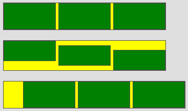

# HBox/VBox

The box layouts lay out their children one after the other. The
horizontal box layout lays out widgets in a horizontal row, from left
to right, while the vertical box layout lays out widgets in a vertical
column, from top to bottom.

## Preview Image

## Features

-   Respects Minimum and maximum dimensions
-   Prioritized growing/shrinking (flex)
-   Margins with horizontal (HBox) resp. vertical (VBox) collapsing)
-   Auto sizing (ignoring percent values)
-   Percent widths (not size hint relevant)
-   Alignment (Children property {@link qx.ui.core.LayoutItem#alignX} is
    ignored)
-   Horizontal (HBox) resp. vertical (VBox) spacing (collapsed with
    margins)
-   Property to reverse children ordering (starting from last to first)
-   Vertical (HBox) resp. horizontal (VBox) children stretching
    (respecting size hints)

## Description

Both box layouts lay out their children one after the other. This
description will discuss the horizontal box layout. Everything said
about the horizontal box layout applies equally to the vertical box
layout just with a vertical orientation.

In addition to the child widget's own preferred width the width of a
child can also be defined as percent ui_layouting.md#percent values.
The percent value is relative to the inner width of the parent widget
without any spacings. This means a horizontal box layout with two
children of width `50%` and with a spacing will fit exactly in the
parent.

The horizontal box layout tries to stretch all children vertically to
the height of the box layout. This can be suppressed by setting the
child property [allowGrowY](apps://apiviewer/#qx.ui.core.LayoutItem~setAllowGrowY)
         to false. If a child is smaller than the layout and cannot be
stretched it will be aligned according to its [alignY](apps://apiviewer/#qx.ui.core.LayoutItem~setAlignY)
         value. The [alignX](apps://apiviewer/#qx.ui.layout.HBox~setAlignX)
       property of the layout itself defines the horizontal alignment
of all the children as a whole.

The horizontal spacing can be defined using the property [spacing](apps://apiviewer/#qx.ui.layout.HBox~setSpacing)
        . In addition to the spacing property each widget can define
left and a right `margin`. Margins and the spacing are always
collapsed to the largest single value. If for example the layout has a
spacing of ` 10` pixel and two consecutive child widgets A and B - A
with a right margin of `15` and B with a left margin of `5` - than the
spacing between these widgets would be `15`, the maximum of these
values.

The preferred height of an horizontal box layout is determined by the
highest child widget. The preferred with is the sum of the widths of
each child plus the spacing resulting from margins and the `spacing`
property.

## Layout properties

-   **flex** _(Integer)_: Defines the flexibility (stretching factor) of the
    child (defaults to `0`)
-   **width** _(String)_: Defines a percent width for the item. The percent
    width, when specified, is used instead of the width defined by the
    size hint. The minimum and maximum width still takes care of the
    elements limitations. It has no influence on the layout's size hint.
    Percents are mainly useful for widgets which are sized by the outer
    hierarchy.

## Alternative Names

-   QVBoxLayout (Qt)
-   StackPanel (XAML)
-   RowLayout (SWT)

## Demos

Here are some links that demonstrate the usage of the layout:

-   [Simple HBox usage](apps://demobrowser/#layout~HBox.html)
-   [HBox with flex widths](apps://demobrowser/#layout~HBox_Flex.html)
-   [HBox with child margins](apps://demobrowser/#layout~HBox_Margin.html)
-   [HBox with percent widths](apps://demobrowser/#layout~HBox_Percent.html)
-   [HBox with switchable ''reversed'' property](apps://demobrowser/#layout~HBox_Reversed.html)
-   [HBox with separators](apps://demobrowser/#layout~HBox_Separator.html)
-   [HBox with vertical shrinking](apps://demobrowser/#layout~HBox_ShrinkY.html)
-   [Simple VBox usage](apps://demobrowser/#layout~VBox.html)
-   [VBox with flex heights](apps://demobrowser/#layout~VBox_Flex.html)
-   [VBox with child margins](apps://demobrowser/#layout~VBox_Margin.html)
-   [VBox with percent heights](apps://demobrowser/#layout~VBox_Percent.html)
-   [VBox with switchable ''reversed'' property](apps://demobrowser/#layout~VBox_Reversed.html)
-   [VBox with separators](apps://demobrowser/#layout~VBox_Separator.html)
-   [VBox with horizontal shrinking](apps://demobrowser/#layout~VBox_ShrinkX.html)

## API

Here is a link to the API of the layout manager:

[qx.ui.layout.HBox](apps://apiviewer/#qx.ui.layout.HBox)  
[qx.ui.layout.VBox](apps://apiviewer/#qx.ui.layout.VBox)
