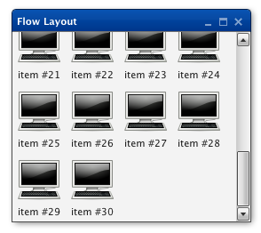

# Flow

> **note**
>
> This layout manager is available since Qooxdoo 0.8.3.

A basic layout, which supports positioning of child widgets in a 'flowing'
manner, starting at the container's top/left position, placing children left to
right (like a HBox) until the there's no remaining room for the next child. When
out of room on the current line of elements, a new line is started, cleared
below the tallest child of the preceding line -- a bit like using 'float' in
CSS, except that a new line wraps all the way back to the left.

## Preview Image

This image shows a gallery implemented using a Flow layout.

## Features

- Reversing children order
- Manual line breaks
- Horizontal alignment of lines
- Vertical alignment of individual widgets within a line
- Margins with horizontal margin collapsing
- Horizontal and vertical spacing
- Height for width calculations
- Auto-sizing

## Description

The Flow layout imitates the way text is rendered. Each child is placed
horizontally next to each other. If the remaining space is too small a new line
is created and the child is placed at the start of the new line.

It is possible to specify a horizontal alignment for all children. This is
equivalent to `center`, `left` or `right` alignment of text blocks. Further it
is possible to specify the vertical alignment of each child in a line.

This layout supports `height for width`, which means that given a fixed width it
can calculate the required height.

## Layout properties

- **lineBreak** _(Boolean)_: If set to `true` a forced line break will happen
  after this child widget.

## Demos

Here are some links that demonstrate the usage of the layout:

- [Flow layout demo](apps://demobrowser/#layout~Flow.html)

## API

Here is a link to the API of the layout manager:
[qx.ui.layout.Flow](apps://apiviewer/#qx.ui.layout.Flow)
