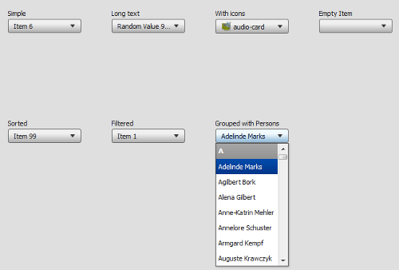

# Virtual SelectBox

The virtual SelectBox acts like the selectbox, but is based on the framework's
virtual infrastructure.

## Preview Image



## Features

- Pointer and keyboard support.
- Items with plain text and/or icons
- Ellipsis: If the label does not fit into the widget's bounds an ellipsis
  (”...”) is rendered at the end of the label.
- Supports filtering, sorting, grouping, data binding and custom rendering like
  the virtuallist.

**Pointer and keyboard behavior:**

<table>
<col width="17%" />
<col width="10%" />
<col width="33%" />
<col width="38%" />
<tbody>
<tr class="odd">
<td align="left"></td>
<td align="left">keyboard</td>
<td align="left"><strong>open drop-down</strong></td>
<td align="left">key down; key up; space; enter</td>
</tr>
<tr class="even">
<td align="left"></td>
<td align="left"></td>
<td align="left"><strong>close drop-down</strong></td>
<td align="left">esc; enter</td>
</tr>
<tr class="odd">
<td align="left"></td>
<td align="left">pointer</td>
<td align="left"><strong>open drop-down</strong></td>
<td align="left">tap on widget</td>
</tr>
<tr class="even">
<td align="left"></td>
<td align="left"></td>
<td align="left"><strong>close drop-down</strong></td>
<td align="left">tap on item; tap outside drop-down</td>
</tr>
<tr class="odd">
<td align="left">drop-down closed</td>
<td align="left">keyboard</td>
<td align="left"><strong>select next</strong></td>
<td align="left">not possible</td>
</tr>
<tr class="even">
<td align="left"></td>
<td align="left"></td>
<td align="left"><strong>select previous</strong></td>
<td align="left">not possible</td>
</tr>
<tr class="odd">
<td align="left"></td>
<td align="left"></td>
<td align="left"><strong>select first</strong></td>
<td align="left">not possible</td>
</tr>
<tr class="even">
<td align="left"></td>
<td align="left"></td>
<td align="left"><strong>select last</strong></td>
<td align="left">not possible</td>
</tr>
<tr class="odd">
<td align="left"></td>
<td align="left">pointer</td>
<td align="left"><strong>select next</strong></td>
<td align="left">not possible</td>
</tr>
<tr class="even">
<td align="left"></td>
<td align="left"></td>
<td align="left"><strong>select previous</strong></td>
<td align="left">not possible</td>
</tr>
<tr class="odd">
<td align="left">drop-down open</td>
<td align="left">keyboard</td>
<td align="left"><strong>select next</strong></td>
<td align="left">key down then enter</td>
</tr>
<tr class="even">
<td align="left"></td>
<td align="left"></td>
<td align="left"><strong>select previous</strong></td>
<td align="left">key up then enter</td>
</tr>
<tr class="odd">
<td align="left"></td>
<td align="left"></td>
<td align="left"><strong>select first</strong></td>
<td align="left">page up then enter</td>
</tr>
<tr class="even">
<td align="left"></td>
<td align="left"></td>
<td align="left"><strong>select last</strong></td>
<td align="left">page down then enter</td>
</tr>
<tr class="odd">
<td align="left"></td>
<td align="left">pointer</td>
<td align="left"><strong>select next</strong></td>
<td align="left">tap on item</td>
</tr>
<tr class="even">
<td align="left"></td>
<td align="left"></td>
<td align="left"><strong>select previous</strong></td>
<td align="left">tap on item</td>
</tr>
<tr class="odd">
<td align="left"></td>
<td align="left"></td>
<td align="left"><strong>wrap in list</strong></td>
<td align="left">no</td>
</tr>
<tr class="even">
<td align="left"></td>
<td align="left"></td>
<td align="left"><strong>preselect</strong></td>
<td align="left">pointer over; key up; key down</td>
</tr>
<tr class="odd">
<td align="left"></td>
<td align="left"></td>
<td align="left"><strong>select drop-down item on open</strong></td>
<td align="left">yes</td>
</tr>
</tbody>
</table>

## Description

The `qx.ui.form.VirtualSelectBox` is based on the virtual infrastructure. It can
be used to select one item and uses the virtuallist as a drop-down.

Using the virtual infrastructure has considerable advantages when there is a
huge amount of model items to render: Widgets are created only for visible items
and reused. This saves both creation time and memory.

The virtual SelectBox uses the same
[qx.ui.list.core.IListDelegate](apps://apiviewer/#qx.ui.list.core.IListDelegate)
interface as the virtuallist to configure the SelectBox's behavior (item and
group renderer configuration, filtering, sorting, grouping, etc.).

> **note**

> Only widget based rendering for list and group items is supported.

## Code Example

Here's an example. We create a simple SelectBox example with 2500 items, sort
the items (ascending), select the 20th item and log each selection change.

```
//create the model data
var rawData = [];
for (var i = 0; i < 2500; i++) {
  rawData[i] = "Item No " + i;
}
var model = qx.data.marshal.Json.createModel(rawData);

//create the SelectBox
var selectBox = new qx.ui.form.VirtualSelectBox(model);

//configure the SelectBox's behavior
var delegate = {
  sorter : function(a, b) {
    return a > b ? 1 : a < b ? -1 : 0;
  }
};
selectBox.setDelegate(delegate);

//Pre-Select "Item No 20"
selectBox.getSelection().push(model.getItem(20));

//log selection changes
selectBox.getSelection().addListener("change", function(e) {
  this.debug("Selection: " + selectBox.getSelection().getItem(0));
}, this);
```

## Demos

Here are some links that demonstrate the usage of the widget:

- [SelectBox demo](apps://demobrowser/#virtual~SelectBox.html)

## API

Here is a link to the API of the widget:
[qx.ui.form.VirtualSelectBox](apps://apiviewer/#qx.ui.form.VirtualSelectBox)
